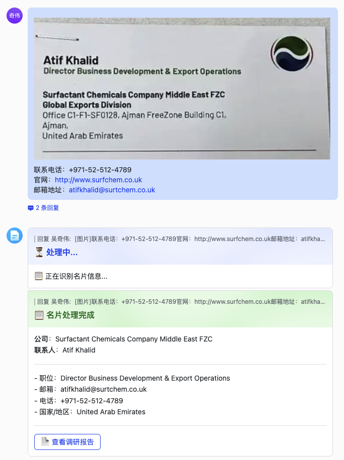

# 海外展会线索录入 Agent

面向海外展会场景的智能 CRM 系统。销售在展会现场发送名片图片，系统自动完成 OCR 识别、重复检测、多维度背调、报告生成，全流程 < 3 分钟。

## 功能亮点

- **名片智能识别** — 基于 Qwen3.5-omni 多模态 LLM，支持中/英/日/韩多语言名片，图片直接理解
- **文本补充解析** — 支持图片+文字同时发送，正则+LLM 双层提取，名片缺失信息可由用户文字补全
- **智能重复检测** — 邮箱/公司名+联系人/电话多规则匹配，支持合并或新建
- **公司名自动发现** — 域名 WHOIS 反查、网页爬取、LinkedIn 搜索等 5 级策略
- **多 Agent 并行背调** — 6 个专业 Agent 并行调研（基础信息、工商法律、财务信用、组织架构、动态新闻、供应链口碑），15+ 数据源
- **交叉验证** — 名片信息与调研数据多源对比，不一致时高亮提示
- **自动报告生成** — 飞书文档 8 章节结构化报告，带引用体系
- **CRM 自动补全** — 自动识别 Bitable 缺失字段并从调研结果中填写

## 效果展示

名片发送后，系统自动完成识别、写入 CRM、触发背调：



## 完整测试用例

共 8 个测试用例（功能一 5 个 + 功能二 3 个），100% 通过：


## 技术架构

```
Feishu Message → MessageHandler → ExhibitionAgent
  → OCR (Qwen3.5-omni multimodal) → Duplicate Checker → Bitable CRM
  → SupervisorAgent.research()
    → Group 1: BasicInfoAgent (serial)
    → Group 2: 5 agents parallel (Legal, Financial, Org, News, SupplyChain)
    → Group 3: CrossValidation → CRM Supplement → ReportWriter
  → FeishuDocClient writes report → Bitable update with link
  → Reply card to user
```

| 组件 | 技术栈 |
|------|--------|
| LLM | Qwen3.5-omni，阿里云百炼 |
| 搜索 | Tavily + DuckDuckGo |
| 飞书集成 | lark-oapi SDK，WebSocket 连接 |
| CRM | 飞书 Bitable 多维表格 |
| 文档 | 飞书 Docx API |
| Web 框架 | FastAPI + Uvicorn |

## 部署

```bash
# 安装依赖
pip install -r requirements.txt

# 配置环境变量
cp .env.example .env  # 填入你的 API Key

# 启动服务
python run.py
```

## 环境变量

参见 `.env.example`，需要配置以下变量：

| 变量 | 说明 |
|------|------|
| `MIMO_API_KEY` | 阿里云百炼 API Key |
| `MIMO_MODEL` | 模型名称（默认 qwen3.5-omni-flash-2026-03-15） |
| `TAVILY_API_KEY` | Tavily 搜索 API Key |
| `FEISHU_APP_ID` | 飞书应用 App ID |
| `FEISHU_APP_SECRET` | 飞书应用 App Secret |
| `FEISHU_BITABLE_APP_TOKEN` | 飞书多维表格 App Token |
| `FEISHU_BITABLE_TABLE_ID` | 飞书多维表格 Table ID |
